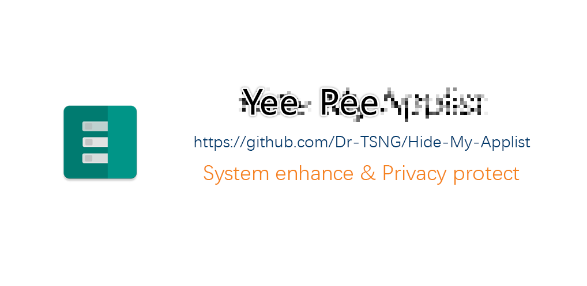

# Yee Pee

# **非官方构建**
## 发生的变化：   
1. 未签名
2. 去除广告减少体积             
3. 更换名称    
4. 修复了全局强制vold data隔离导致应用商店,浏览器,等应用阻塞崩溃的问题            
---
[安卓系统的策略](https://android.googlesource.com/platform/frameworks/base/+/master/services/core/java/com/android/server/am/ProcessList.java)是符合条件
```
persist.sys.vold_app_data_isolation_enabled == 1
                && UserHandle.isApp(app.uid)
                && !storageManagerInternal.isExternalStorageService(app.uid)
                && mountMode != Zygote.MOUNT_EXTERNAL_ANDROID_WRITABLE
                && mountMode != Zygote.MOUNT_EXTERNAL_PASS_THROUGH
                && mountMode != Zygote.MOUNT_EXTERNAL_INSTALLER
                && mountMode != Zygote.MOUNT_EXTERNAL_NONE
                && pkgDataInfoMap != null 
                && storageManagerInternal.isFuseMounted(userId)
```
的情况下让  
indMountAppStorageDirs = true;  
  

  
[官方HMA的策略](https://github.com/Dr-TSNG/Hide-My-Applist/commit/2eddefd1be3c5d378ff0c1b055935d0301387c81)是符合条件
```
persist.sys.vold_app_data_isolation_enabled == 1
```
的情况下让  
indMountAppStorageDirs = true;  
  
经测试A13/A14/matrix/hyperos系统上，  
1. 对于所有应用，HMA的策略结果是indMountAppStorageDirs = true;导致少数重要应用阻塞崩溃，例如kiwi浏览器,brave浏览器,小米应用商店,一些应用的web容器,应用的某些子进程。这对一些应用而言 被勾选等于被冻结  
2. 对于上述受影响的应用或局部功能启动时，安卓系统的策略结果是indMountAppStorageDirs = flase;对于其他应用结果仍然是ture。没有发生阻塞崩溃问题
### 修复如下    
```kotlin
// if (sVoldAppDataIsolationEnabled) param.args[21] = true // boolean bindMountAppStorageDirs
// 默认由安卓系统判断这次bindMountAppStorageDirs值 

   if (service.isVoldEnabled(app)) param.args[21] = true // 保留强制隔离vold data的功能
```
---
---
```
Hide-My-Applist
├─ app
│  ├─ build.gradle.kts
│  ├─ proguard-rules.pro
│  └─ src
│     └─ main
│        ├─ AndroidManifest.xml
│        ├─ ic_launcher-playstore.png
│        ├─ java
│        │  └─ icu
│        │     └─ andorid
│        │        └─ yeepee
│        │           ├─ MyApp.kt
│        │           ├─ data
│        │           │  └─ UpdateInfo.kt
│        │           ├─ service
│        │           │  ├─ ConfigManager.kt
│        │           │  ├─ PrefManager.kt
│        │           │  ├─ ServiceClient.kt
│        │           │  └─ ServiceProvider.kt
│        │           ├─ ui
│        │           │  ├─ activity
│        │           │  │  ├─ AboutActivity.kt
│        │           │  │  └─ MainActivity.kt
│        │           │  ├─ adapter
│        │           │  │  ├─ AppManageAdapter.kt
│        │           │  │  ├─ AppScopeAdapter.kt
│        │           │  │  ├─ AppSelectAdapter.kt
│        │           │  │  ├─ LogAdapter.kt
│        │           │  │  └─ TemplateAdapter.kt
│        │           │  ├─ fragment
│        │           │  │  ├─ AppManageFragment.kt
│        │           │  │  ├─ AppSelectFragment.kt
│        │           │  │  ├─ AppSettingsFragment.kt
│        │           │  │  ├─ HomeFragment.kt
│        │           │  │  ├─ LogsFragment.kt
│        │           │  │  ├─ ScopeFragment.kt
│        │           │  │  ├─ SettingsFragment.kt
│        │           │  │  ├─ TemplateManageFragment.kt
│        │           │  │  └─ TemplateSettingsFragment.kt
│        │           │  ├─ receiver
│        │           │  │  └─ AppChangeReceiver.kt
│        │           │  ├─ util
│        │           │  │  ├─ Fragment.kt
│        │           │  │  ├─ ThemeUtils.kt
│        │           │  │  └─ Toast.kt
│        │           │  ├─ view
│        │           │  │  ├─ AppItemView.kt
│        │           │  │  └─ ListItemView.kt
│        │           │  └─ viewmodel
│        │           │     ├─ AppSettingsViewModel.kt
│        │           │     └─ TemplateSettingsViewModel.kt
│        │           └─ util
│        │              ├─ PackageHelper.kt
│        │              └─ SuUtils.kt
│        └─ res
│           ├─ drawable
│           │  ├─ baseline_add_24.xml
│           │  ├─ baseline_apps_24.xml
│           │  ├─ baseline_arrow_back_24.xml
│           │  ├─ baseline_assignment_24.xml
│           │  ├─ baseline_call_split_24.xml
│           │  ├─ baseline_home_24.xml
│           │  ├─ baseline_my_location_24.xml
│           │  ├─ baseline_refresh_24.xml
│           │  ├─ baseline_settings_24.xml
│           │  ├─ cont_author.webp
│           │  ├─ cont_cpp_master.webp
│           │  ├─ cont_icon_designer.webp
│           │  ├─ cont_k.webp
│           │  ├─ ic_home_checkable.xml
│           │  ├─ ic_logs_checkable.xml
│           │  ├─ ic_outline_layers_24.xml
│           │  ├─ ic_settings_checkable.xml
│           │  ├─ outline_android_24.xml
│           │  ├─ outline_assignment_24.xml
│           │  ├─ outline_backup_24.xml
│           │  ├─ outline_bug_report_24.xml
│           │  ├─ outline_cleaning_services_24.xml
│           │  ├─ outline_dark_mode_24.xml
│           │  ├─ outline_delete_24.xml
│           │  ├─ outline_discount_24.xml
│           │  ├─ outline_done_all_24.xml
│           │  ├─ outline_edit_24.xml
│           │  ├─ outline_extension_off_24.xml
│           │  ├─ outline_format_color_fill_24.xml
│           │  ├─ outline_yhide_image_24.xml
│           │  ├─ outline_home_24.xml
│           │  ├─ outline_info_24.xml
│           │  ├─ outline_invert_colors_24.xml
│           │  ├─ outline_language_24.xml
│           │  ├─ outline_palette_24.xml
│           │  ├─ outline_save_24.xml
│           │  ├─ outline_sd_storage_24.xml
│           │  ├─ outline_settings_24.xml
│           │  ├─ outline_settings_backup_restore_24.xml
│           │  ├─ outline_shield_24.xml
│           │  ├─ outline_speed_24.xml
│           │  ├─ outline_stop_circle_24.xml
│           │  ├─ outline_storage_24.xml
│           │  ├─ outline_translate_24.xml
│           │  └─ outline_update_disabled_24.xml
│           ├─ menu
│           │  ├─ menu_about.xml
│           │  ├─ menu_app_list.xml
│           │  ├─ menu_delete.xml
│           │  ├─ menu_logs.xml
│           │  └─ menu_nav.xml
│           ├─ mipmap-anydpi-v26
│           │  ├─ ic_launcher.xml
│           │  └─ ic_launcher_round.xml
│           ├─ mipmap-hdpi
│           │  ├─ ic_launcher.png
│           │  ├─ ic_launcher_background.png
│           │  ├─ ic_launcher_foreground.png
│           │  └─ ic_launcher_round.png
│           ├─ mipmap-mdpi
│           │  ├─ ic_launcher.png
│           │  ├─ ic_launcher_background.png
│           │  ├─ ic_launcher_foreground.png
│           │  └─ ic_launcher_round.png
│           ├─ mipmap-xhdpi
│           │  ├─ ic_launcher.png
│           │  ├─ ic_launcher_background.png
│           │  ├─ ic_launcher_foreground.png
│           │  └─ ic_launcher_round.png
│           ├─ mipmap-xxhdpi
│           │  ├─ ic_launcher.png
│           │  ├─ ic_launcher_background.png
│           │  ├─ ic_launcher_foreground.png
│           │  └─ ic_launcher_round.png
│           ├─ mipmap-xxxhdpi
│           │  ├─ ic_launcher.png
│           │  ├─ ic_launcher_background.png
│           │  ├─ ic_launcher_foreground.png
│           │  └─ ic_launcher_round.png
│           ├─ navigation
│           │  ├─ home_nav_graph.xml
│           │  └─ main_nav_graph.xml
│           ├─ values
│           │  ├─ arrays.xml
│           │  ├─ attrs.xml
│           │  ├─ colors.xml
│           │  ├─ dimens.xml
│           │  ├─ strings.xml
│           │  ├─ styles.xml
│           │  ├─ themes.xml
│           │  ├─ themes_custom.xml
│           │  ├─ themes_overlay.xml
│           │  └─ themes_override.xml
│           ...
│           └─ xml
│              ├─ app_settings.xml
│              ├─ settings.xml
│              └─ settings_data_isolation.xml
├─ banner.png
├─ build.gradle.kts
├─ common
│  ├─ build.gradle.kts
│  ├─ proguard-rules.pro
│  └─ src
│     └─ main
│        ├─ aidl
│        │  └─ icu
│        │     └─ andorid
│        │        └─ yeepee
│        │           └─ common
│        │              └─ IYEPService.aidl
│        └─ java
│           └─ icu
│              └─ andorid
│                 └─ yeepee
│                    └─ common
│                       ├─ CommonUtils.kt
│                       ├─ Constants.java
│                       └─ JsonConfig.kt
├─ crowdin.yml
├─ gradle
│  ├─ libs.versions.toml
│  └─ wrapper
│     ├─ gradle-wrapper.jar
│     └─ gradle-wrapper.properties
├─ gradle.properties
├─ gradlew
├─ gradlew.bat
├─ settings.gradle.kts
└─ xposed
   ├─ build.gradle.kts
   ├─ proguard-rules.pro
   └─ src
      └─ main
         ├─ assets
         │  └─ xposed_init
         └─ java
            └─ icu
               └─ andorid
                  └─ yeepee
                     └─ xposed
                        ├─ YEPService.kt
                        ├─ Logcat.kt
                        ├─ UserService.kt
                        ├─ Utils.kt
                        ├─ XposedEntry.kt
                        └─ hook
                           ├─ IFrameworkHook.kt
                           ├─ PmsHookLegacy.kt
                           ├─ PmsHookTarget28.kt
                           ├─ PmsHookTarget30.kt
                           ├─ PmsHookTarget33.kt
                           └─ ZygoteArgsHook.kt

```
